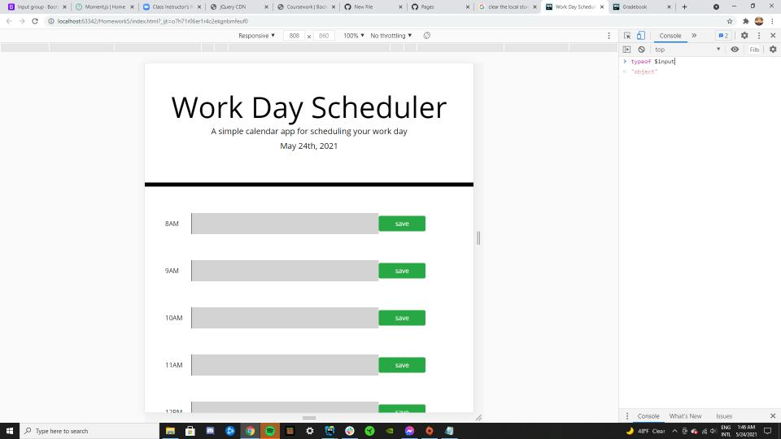

# Homework5
Day planer
 
first we use moment() to display todays date
 
then we used jquey to add my rows with the times, inputbox, and a save btn
 
linked bootsrap's lybary to add some style to my btn and my textbox 
 
I got stuck on saving the input to the local storage
 
https://izaaaqk.github.io/Homework5/
 
